# Architecture Documentation - FinSight AI

This document describes the system architecture, design patterns, data flow, and key technical decisions for FinSight AI.

## Table of Contents

1. [System Architecture](#system-architecture)
2. [Component Architecture](#component-architecture)
3. [Data Flow](#data-flow)
4. [Database Schema](#database-schema)
5. [Design Patterns](#design-patterns)
6. [Key Technical Decisions](#key-technical-decisions)
7. [Security Architecture](#security-architecture)
8. [Performance Architecture](#performance-architecture)

## System Architecture

### High-Level Architecture

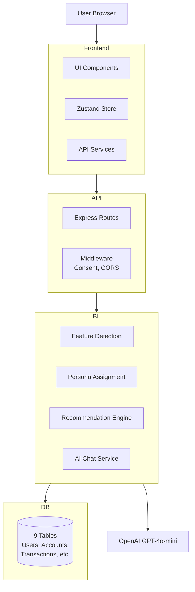

### Technology Stack

#### Frontend
- **React 18** - UI framework
- **TypeScript** - Type safety
- **Vite** - Build tool and dev server
- **Tailwind CSS** - Styling
- **Zustand** - State management
- **Recharts** - Data visualization
- **Axios** - HTTP client
- **Lucide React** - Icons

#### Backend
- **Node.js** - Runtime
- **Express** - Web framework
- **TypeScript** - Type safety
- **SQLite** - Database
- **OpenAI API** - AI features
- **Jest** - Testing framework

## Component Architecture

### Frontend Architecture

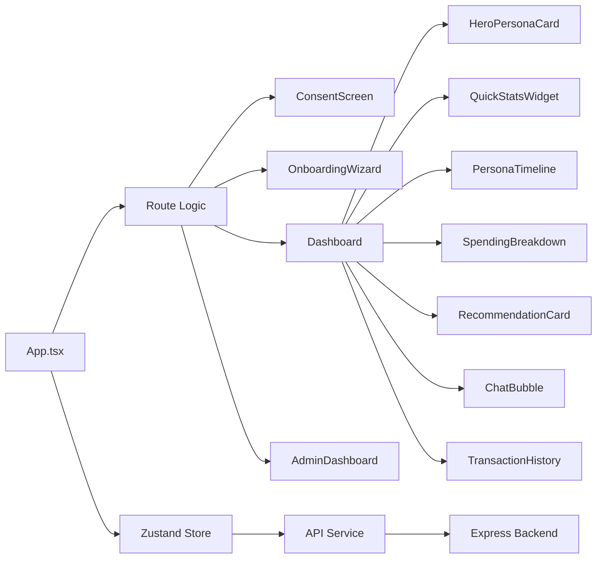

### Backend Architecture

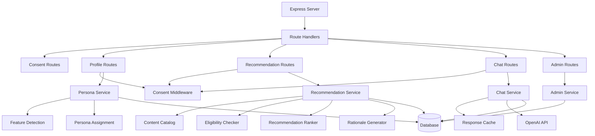

### Feature Detection Modules

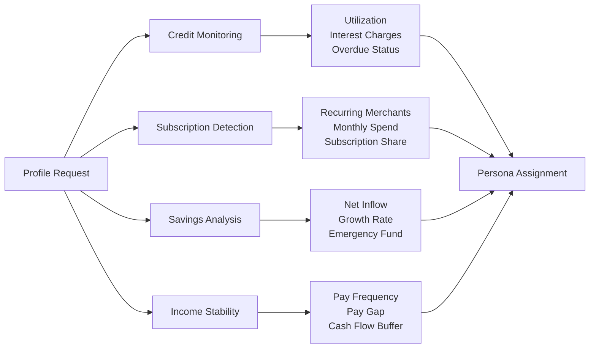

## Data Flow

### User Onboarding Flow

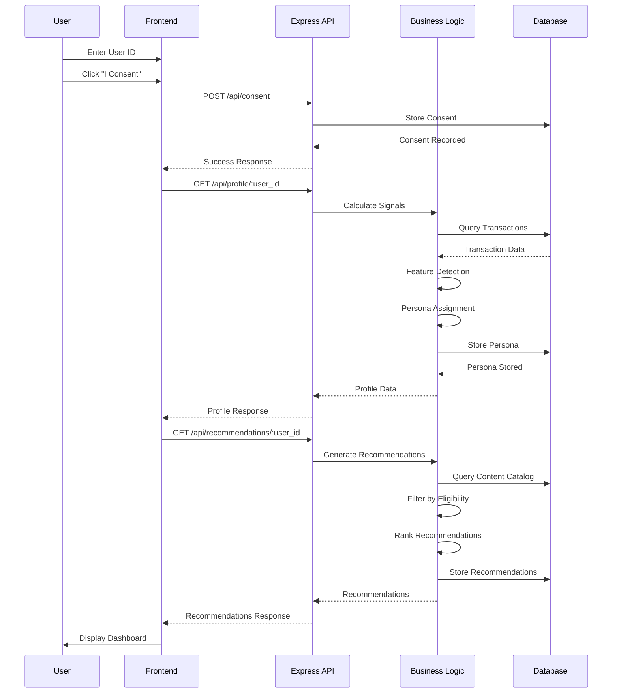

### Chat Flow

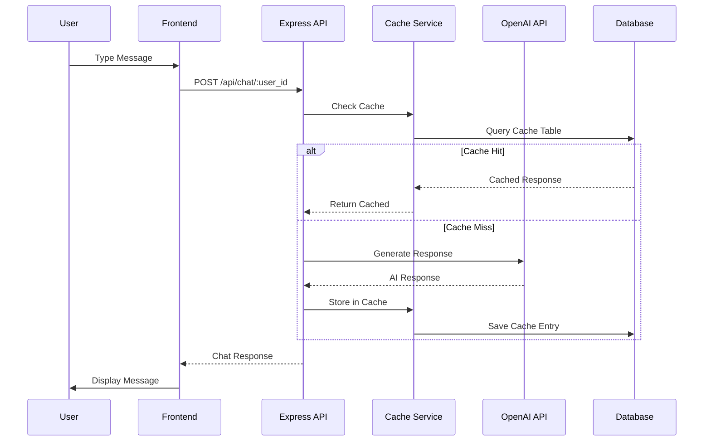

### Recommendation Generation Flow

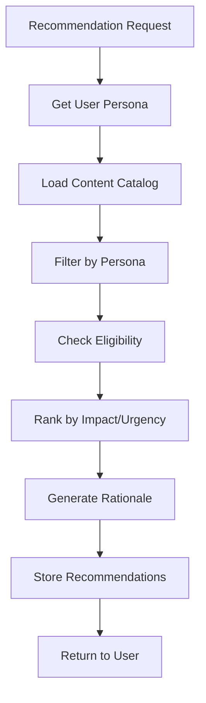

## Database Schema

### Entity Relationship Diagram

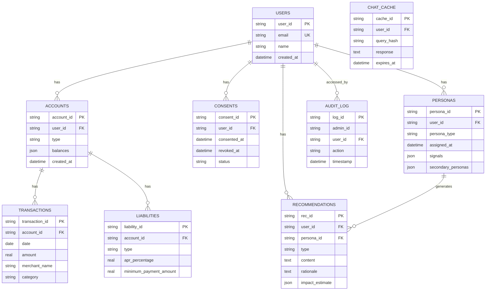

### Indexes

The database includes optimized indexes for performance:

- `idx_accounts_user_id` - Fast user account lookups
- `idx_transactions_account_id` - Fast transaction queries
- `idx_transactions_account_date` - Composite index for date-sorted queries
- `idx_transactions_merchant_name` - Fast merchant searches
- `idx_personas_user_assigned_at` - Fast persona history queries
- `idx_recommendations_user_type` - Fast recommendation filtering
- `idx_consents_user_status` - Fast consent checks
- `idx_chat_cache_query_hash` - Fast cache lookups

## Design Patterns

### State Management Pattern

**Zustand Store Structure:**
```typescript
interface UserState {
  userId: string | null;
  hasConsent: boolean;
  persona: Persona | null;
  signals: Signals | null;
  recommendations: Recommendation[];
  loading: boolean;
  error: string | null;
  chatOpen: boolean;
  chatMessages: ChatMessage[];
  isAdmin: boolean;
}
```

**Benefits:**
- Simple API with minimal boilerplate
- TypeScript support
- Easy to test and debug
- Sufficient for MVP scope

### API Pattern

**RESTful Endpoints:**
- `GET /api/health` - Health check
- `POST /api/consent` - Consent management
- `GET /api/profile/:user_id` - User profile (requires consent)
- `GET /api/recommendations/:user_id` - Recommendations (requires consent)
- `POST /api/chat/:user_id` - AI chat (requires consent)
- `GET /api/admin/*` - Admin endpoints

**Response Format:**
```typescript
// Success
{ data: T }

// Error
{ error: string, message?: string }
```

### Feature Detection Pattern

Each feature module follows this pattern:

```typescript
export async function detectFeature(
  userId: string,
  windowDays?: number
): Promise<FeatureResult> {
  // 1. Query database
  // 2. Process data
  // 3. Calculate metrics
  // 4. Return structured result
}
```

**Benefits:**
- Pure functions (testable)
- Consistent interface
- Reusable across personas
- Easy to extend

### Persona Assignment Pattern

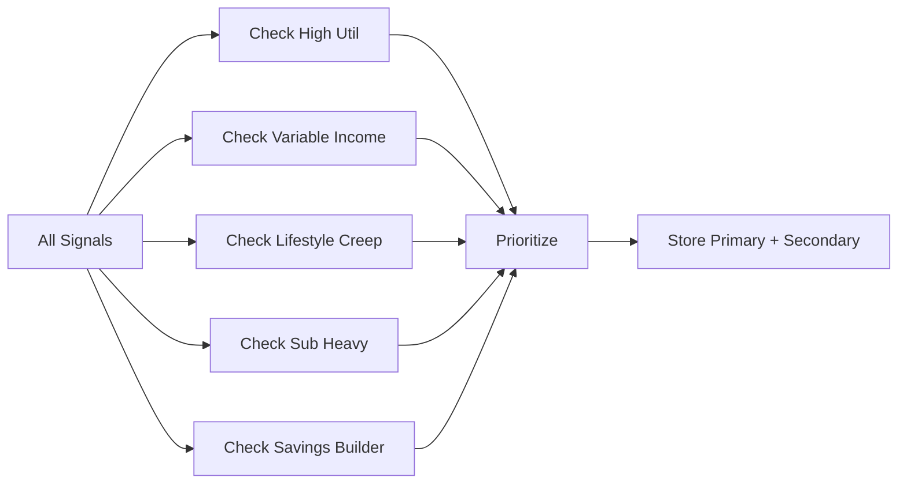

### Recommendation Pattern

1. **Load Content Catalog** - Get all available content
2. **Filter by Persona** - Match persona to relevant content
3. **Check Eligibility** - Verify user meets requirements
4. **Rank by Impact** - Calculate impact and urgency scores
5. **Generate Rationale** - AI-powered or template-based
6. **Store Results** - Save for auditability

## Key Technical Decisions

### Why SQLite?

**Decision:** Use SQLite for local development and demo.

**Rationale:**
- No external database server required
- Sufficient for 100 users with 12 months of data
- Easy to backup and share
- Fast for read-heavy workloads
- Simple setup for developers

**Trade-offs:**
- Not suitable for production scale
- Limited concurrent writes
- No built-in replication

**Future:** Migrate to PostgreSQL for production.

### Why Zustand?

**Decision:** Use Zustand for state management.

**Rationale:**
- Less boilerplate than Redux
- Simple API for MVP scope
- Good TypeScript support
- Sufficient for current needs

**Trade-offs:**
- Less ecosystem than Redux
- May need migration for complex state

**Future:** Consider Redux Toolkit if state becomes complex.

### Why GPT-4o-mini?

**Decision:** Use GPT-4o-mini for AI features.

**Rationale:**
- Cost optimization vs GPT-4
- Sufficient quality for educational content
- Faster response times
- Lower token usage

**Trade-offs:**
- Less capable than GPT-4
- May need upgrade for complex queries

**Future:** Consider GPT-4 for premium features.

### Why Normalized Schema?

**Decision:** Use normalized database schema.

**Rationale:**
- Data integrity
- Avoid duplication
- Easier to query and analyze
- Standard relational practices

**Trade-offs:**
- More joins required
- Slightly more complex queries

**Future:** Consider denormalization for read-heavy paths.

## Security Architecture

### Consent Enforcement

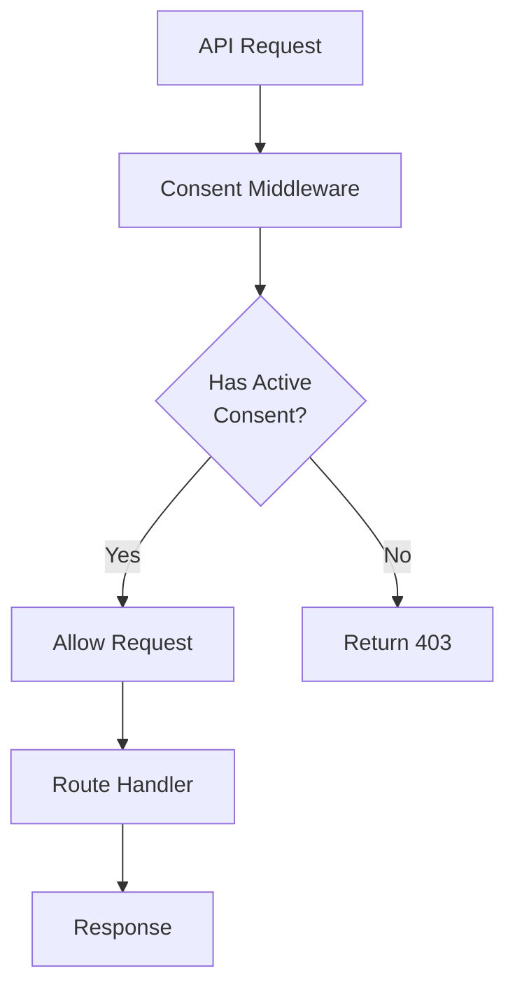

**Implementation:**
- Middleware checks `consents` table
- Returns 403 if no active consent
- All sensitive endpoints protected

### Admin Access Control

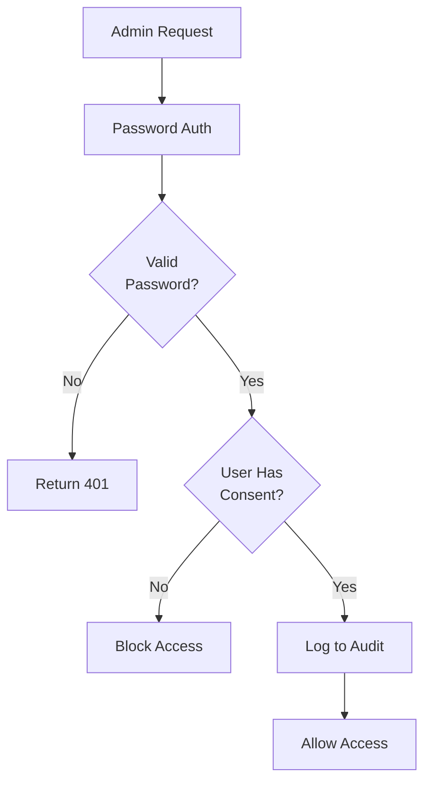

**Implementation:**
- Simple password authentication (demo only)
- Audit logging for all admin actions
- Cannot access non-consented users
- Read-only access

### Input Validation

- All API inputs validated
- User IDs and account IDs checked
- SQL injection protection (parameterized queries)
- Type checking with TypeScript

## Performance Architecture

### Caching Strategy

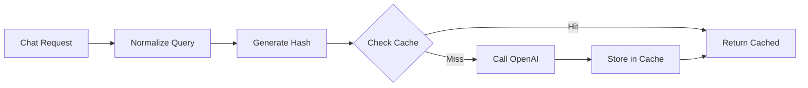

**Implementation:**
- 1-hour TTL for chat responses
- Query normalization for cache hits
- SHA-256 hash for cache keys

### Database Optimization

- Composite indexes for common queries
- Indexes on foreign keys
- Query optimization for date ranges
- Pagination for large result sets

### Frontend Optimization

- Code splitting for admin routes
- Lazy loading of components
- Memoization for Recharts
- Skeleton loaders for async content
- API response caching headers

## Future Considerations

### Production Readiness

1. **Authentication & Authorization**
   - OAuth 2.0 / JWT tokens
   - Role-based access control
   - Session management

2. **Database**
   - Migrate to PostgreSQL
   - Connection pooling
   - Read replicas for scale

3. **Infrastructure**
   - Docker containers
   - Kubernetes orchestration
   - CI/CD pipelines
   - Monitoring and logging

4. **Security**
   - HTTPS/TLS
   - Rate limiting
   - Input sanitization
   - Security headers

5. **Scalability**
   - Horizontal scaling
   - Load balancing
   - Caching layer (Redis)
   - Message queue for async tasks

